I design and build software end to end: the idea, the interface and the code underneath it. The sky above is redrawn every morning, and the homepage draws the same sky in full if you click it.

**Live work**

- [Broadcast](https://broadcast.justinthevoid.com): a website where a television is the interface, for a fictional band
- [Late Edition](https://late-edition.justinthevoid.com): a pocket zine for people who work nights: turn the pages, tear tabs off a flyer, peel the stickers
- [Ask the Harbour Office](https://harbour.justinthevoid.com): an AI help line for a ferry company that doesn't exist, which you can ask out loud
- [Euclid](https://euclid.justinthevoid.com): a desktop that boots as Windows 98 or XP and switches between them in place, with Clippy at the switch

**Open source**

- [xcforge](https://github.com/justinthevoid/xcforge): build, test and drive iOS apps from any AI agent or the terminal
- [ShutterCoach](https://github.com/justinthevoid/ShutterCoach): an iPhone photography mentor that critiques the shot you took and teaches you the next one
- [recipe](https://github.com/justinthevoid/recipe): convert Nikon picture controls (NP3) and Lightroom presets (XMP), in both directions

[justinthevoid.com](https://justinthevoid.com) · [All work](https://justinthevoid.com/work/) · [Say hello](mailto:hello@justinthevoid.com)
